# SMS Gateway

[English](README.md) | **Español**

Una pasarela de SMS autoalojada que ofrece una interfaz web y una API REST para enviar y recibir SMS a través de un módem GSM USB. Está hecha con Go y React y se distribuye como un único binario.

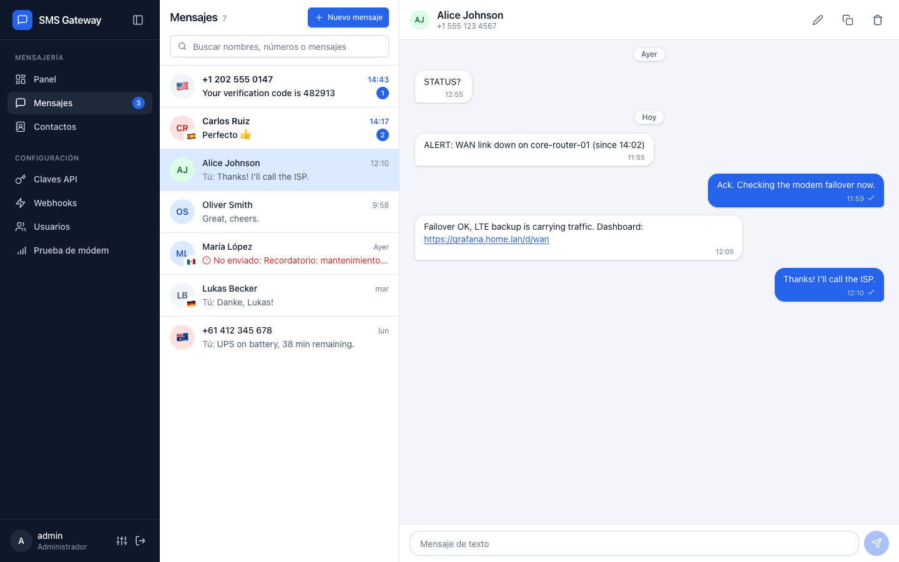

> Este documento es la traducción al español de [README.md](README.md). Si hay alguna diferencia, la versión en inglés es la de referencia.

## Contenido

- [¿Por qué SMS Gateway?](#por-qué-sms-gateway)
- [Características](#características)
- [Requisitos de hardware](#requisitos-de-hardware)
- [Capturas de pantalla](#capturas-de-pantalla)
- [Inicio rápido](#inicio-rápido)
- [Inicio de sesión por defecto](#inicio-de-sesión-por-defecto)
- [Interfaz web](#interfaz-web)
- [Integración con OpenClaw](#integración-con-openclaw)
- [Configuración](#configuración)
- [Comandos de la CLI](#comandos-de-la-cli)
- [API](#api)
- [Webhooks](#webhooks)
- [Desarrollo](#desarrollo)
- [Licencia](#licencia)

## ¿Por qué SMS Gateway?

Hay muchos servicios en la nube que te alquilan un número para enviar y recibir
SMS. Ponerlo a funcionar de verdad es otra historia: registro de marca y campaña
A2P 10DLC, revisión del caso de uso, plantillas de mensajes aprobadas, cobro por
segmento y el riesgo constante de que el operador filtre o suspenda el servicio.
Para un home lab, las alertas de un pequeño negocio o un proyecto personal, es
mucho papeleo para mandar un mensaje de texto.

Este proyecto toma el otro camino. Conecta un módem GSM USB a una máquina, inserta
una SIM con un plan de SMS y ya tienes tu propia pasarela. Sin registros, sin
revisiones, sin precio por mensaje y sin ningún proveedor entre tú y tus mensajes.

### Tus alertas siguen llegando cuando tu internet no

Esta es la razón principal. Un sistema de monitorización que depende de un
proveedor de SMS en la nube necesita internet para avisarte de que tu internet
no funciona. Cuando se cae el enlace WAN de tu casa o tu rack pierde la conexión,
el momento en que más necesitas una alerta es justo cuando desaparece tu canal de
notificaciones.

Un módem GSM USB envía por la red celular, un camino completamente independiente
de tu proveedor de internet. Mientras haya cobertura, los mensajes siguen fluyendo
en ambas direcciones. Tu sistema de monitorización puede avisarte de la caída
mientras ocurre, y tú puedes responder con un comando para consultar el estado o
lanzar un procedimiento.

### Otras razones para autoalojarlo

- **Tus datos son tuyos.** Los mensajes se guardan en tu propia base de datos
  SQLite o PostgreSQL, no en el panel de un proveedor con una política de
  retención que no controlas.
- **Coste predecible.** Una tarifa mensual fija de la SIM en lugar de un cobro por
  segmento que crece con el ruido de tus alertas.
- **Sin filtrado de contenido.** Operadores y agregadores filtran habitualmente el
  tráfico A2P. Los mensajes enviados desde una SIM de consumo tienen muchas menos
  probabilidades de desaparecer sin aviso.
- **Privacidad.** El contenido de los mensajes nunca pasa por terceros.
- **Integración sencilla.** Una API REST con claves API funciona con cualquier cosa
  capaz de hacer una petición HTTP, desde un script de shell hasta Prometheus
  Alertmanager o un agente de IA.
- **Hardware barato.** Una Raspberry Pi, un módem USB y una SIM es todo lo que
  necesitas.

## Características

**Mensajería**

- Envío y recepción de SMS a través de un módem GSM USB
- Vista **Mensajes** tipo chat: los mensajes se agrupan en conversaciones por número, con indicadores de no leídos, búsqueda por nombre, número o texto, separadores por día, estado de envío, reintento de envíos fallidos y carga del historial
- Los mensajes largos (hasta 918 caracteres) se envían como SMS concatenados en modo PDU, de modo que el teléfono los muestra como un único mensaje; el texto fuera del alfabeto GSM (emojis, ciertos acentos) se codifica en UCS-2 automáticamente
- Campo de teléfono internacional: el `+` se añade solo, el número se formatea mientras escribes y el país se detecta por el prefijo (bandera y nombre)
- Los destinatarios deben estar en formato internacional E.164 (`+` y código de país) o ser un código corto de 3 a 6 dígitos, para que todas las conversaciones guarden los números igual
- **Contactos**: asigna un nombre a cada número, edítalo directamente desde la cabecera de la conversación y gestiona todos los nombres desde la página Contactos
- Texto de los mensajes seleccionable y enlaces `http(s)` clicables
- Seguimiento de actividad en segundo plano: una única consulta ligera mantiene al día el contador de no leídos, el panel, la lista de conversaciones y la conversación abierta, y muestra los no leídos en el título de la pestaña

**Administración**

- API REST con autenticación por JWT y por clave API
- Gestión de claves API para acceso programático (desactivar o eliminar claves)
- Webhooks firmados con notificaciones en tiempo real de mensajes recibidos, enviados y fallidos
- Gestión de usuarios con rol de administrador; los administradores pueden eliminar usuarios no administradores (las cuentas de administrador están protegidas)
- Página **Prueba de módem** con estado del módem, intensidad de señal y una **consola AT**: autocompletado, referencia integrada de comandos AT (V.250, 3GPP TS 27.007/27.005), interpretación de respuestas en lenguaje sencillo, comandos rápidos, registro persistente estilo terminal y confirmación para comandos peligrosos
- Limitación de intentos de inicio de sesión y cambio obligatorio de la contraseña generada para `admin`

**Interfaz web**

- Interfaz React adaptable que funciona en móviles, tabletas y escritorio
- Traducciones al inglés y al español, con detección automática del idioma del navegador
- Temas claro, oscuro y del sistema
- Barra lateral de navegación plegable y redimensionable; un panel de **Preferencias** agrupa idioma y tema
- Diálogos de confirmación integrados para acciones destructivas

**Despliegue**

- Endpoint de salud para monitorización
- Base de datos SQLite (por defecto) o PostgreSQL
- Documentación interactiva de la API con Swagger en `/swagger/`
- Despliegue en un único binario (frontend embebido con `go:embed`)
- Multiplataforma: Linux x86_64, macOS ARM64, Raspberry Pi
- Imagen Docker publicada en GHCR

## Requisitos de hardware

Para usar SMS Gateway necesitas un módem GSM USB y una SIM activa con SMS.

### Módem GSM USB

Usamos y recomendamos el [módem USB SIM7600G-H 4G LTE](https://www.amazon.com/dp/B0BHQFTFPH?tag=mattboston-20). Soporta bandas 4G LTE globales, funciona directamente en Linux (incluida la Raspberry Pi) y expone una interfaz serie estándar para comandos AT. Para documentación detallada, diagramas de pines y resolución de problemas, consulta la [wiki de Waveshare del SIM7600G-H](https://www.waveshare.com/wiki/SIM7600G-H_4G_DONGLE).


### Tarjeta SIM

Sirve cualquier SIM con un plan de SMS activo. Nosotros usamos [Tello](https://tello.com/account/register?_referral=P30KX3Z2), que ofrece planes de prepago económicos sobre la red de T-Mobile (unos 8 USD/mes con SMS ilimitados).

> **Nota:** los enlaces anteriores son enlaces de referido. Usarlos ayuda a financiar el desarrollo del proyecto y se agradece mucho.
>
> Si quieres apoyar aún más el proyecto, echa un vistazo a la [lista de deseos de Amazon](https://www.amazon.com/hz/wishlist/ls/T3L6QCKZJ4Q4?ref_=wl_share).

## Capturas de pantalla

Las capturas de la interfaz en inglés están en el [README en inglés](README.md#screenshots).

### Panel

Estado del módem, señal, totales de mensajes, envío rápido y mensajes recientes.

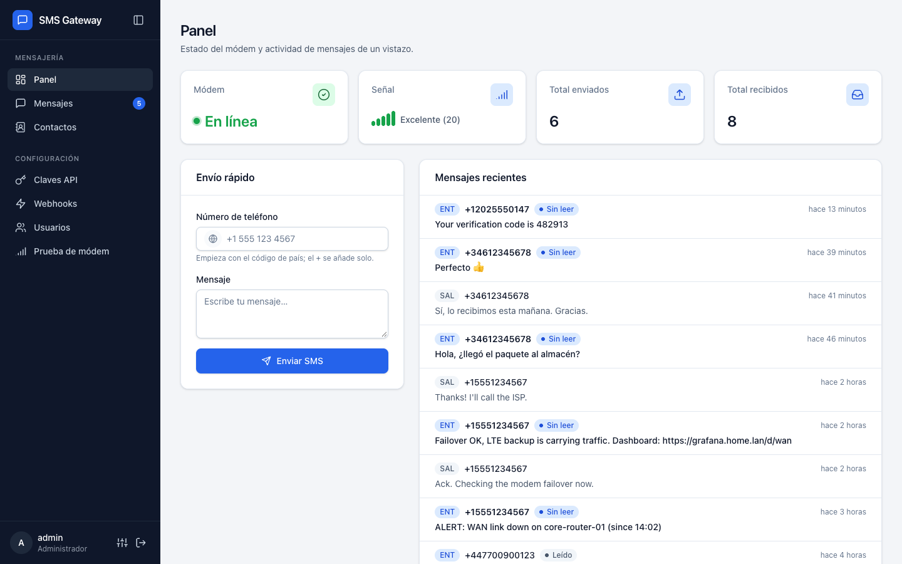

### Mensajes

Conversaciones a la izquierda y la conversación abierta a la derecha. Mensajes entrantes y salientes, estado de envío, enlaces y nombres de contacto.


### Nuevo mensaje

Campo de teléfono internacional con detección de país y validación del número.

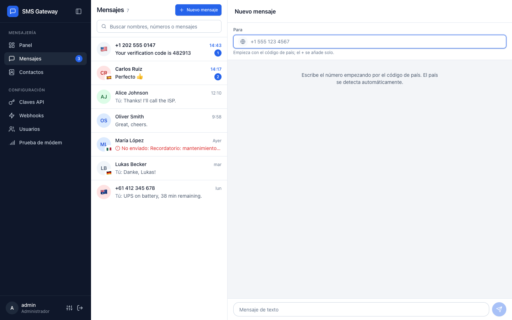

### Contactos

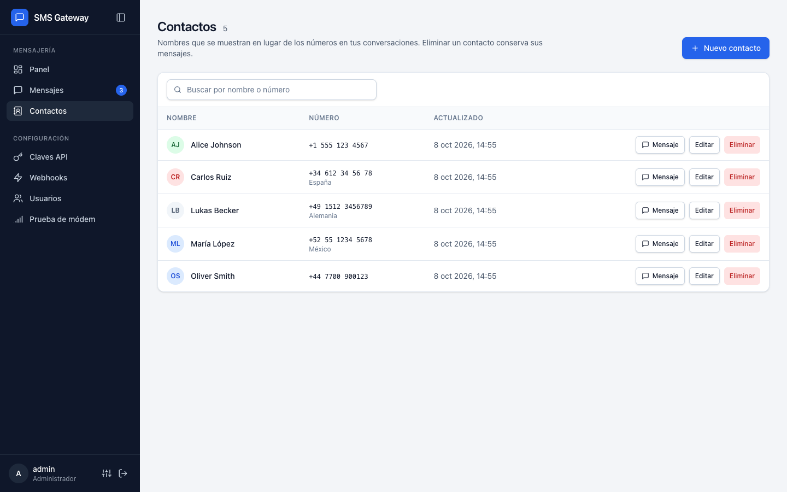

### Claves API

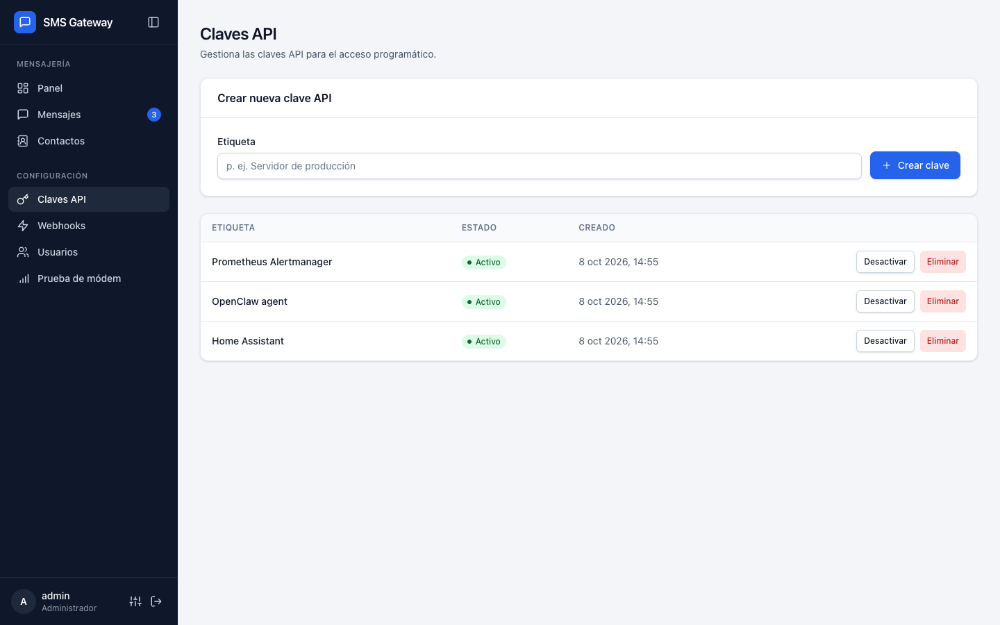

### Webhooks

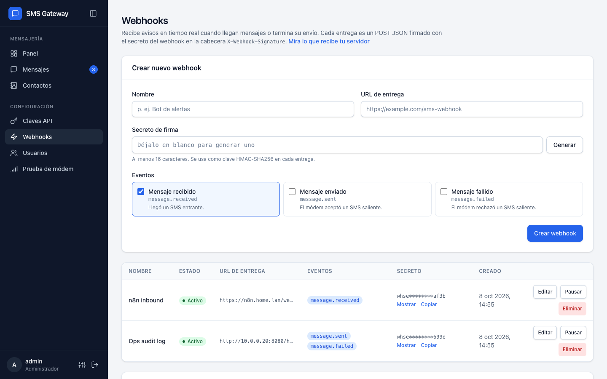

### Usuarios

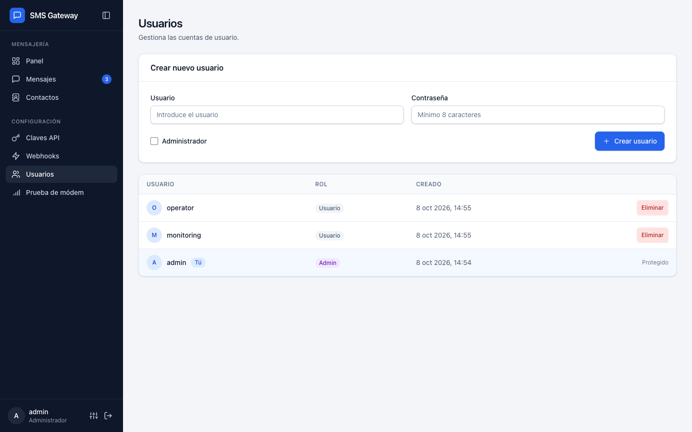

### Prueba de módem y consola AT

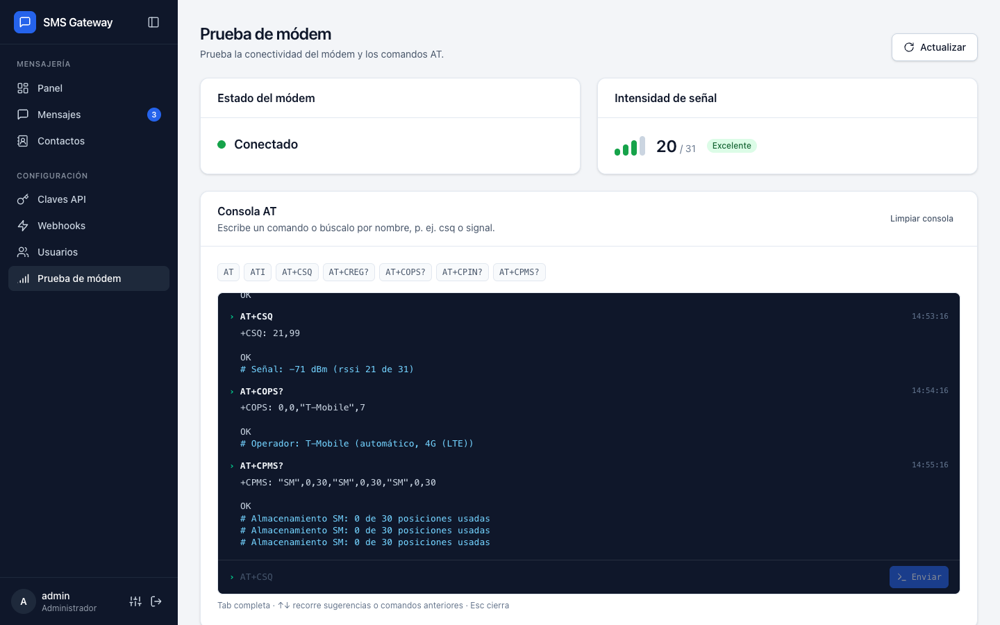

### Preferencias

Idioma (Auto, inglés, español) y tema (Claro, Oscuro, Sistema).

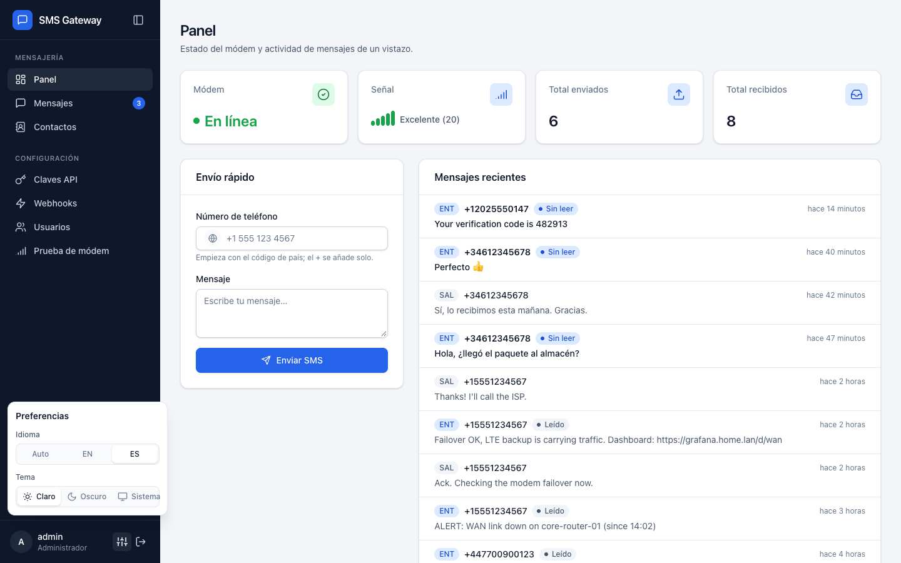

### Tema oscuro

| Panel | Mensajes |
|-------|----------|
| 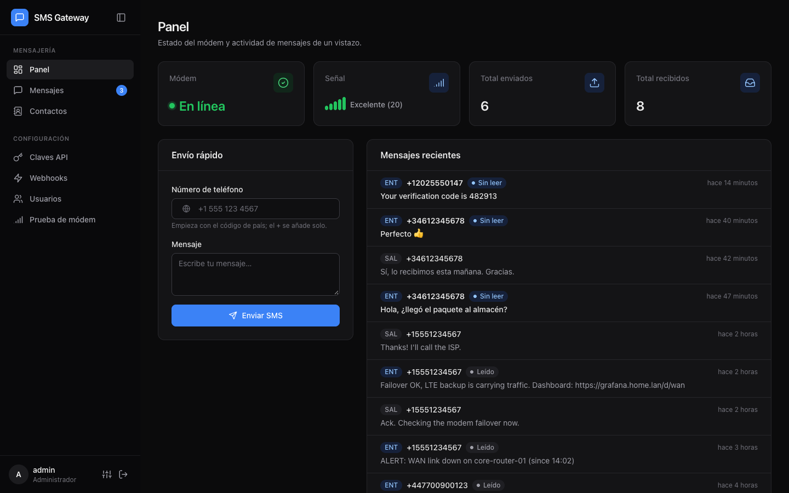 | 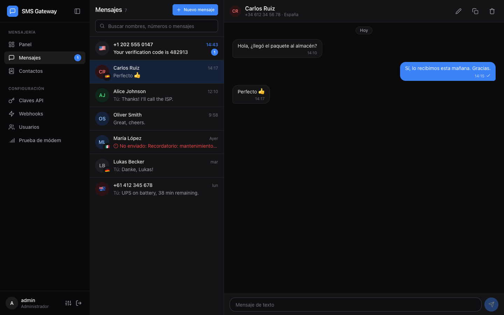 |

### Móvil

| Panel | Conversaciones | Conversación |
|-------|----------------|--------------|
| 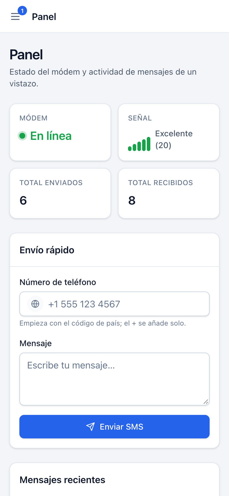 | 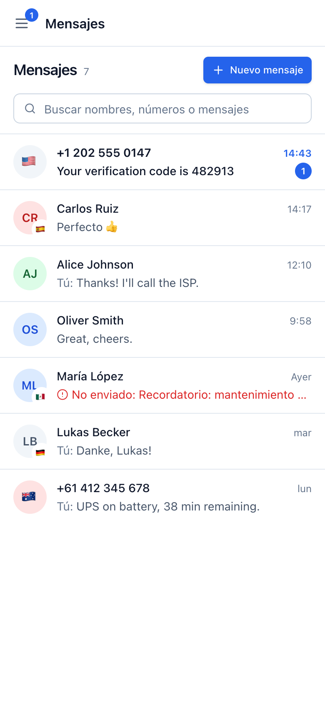 | 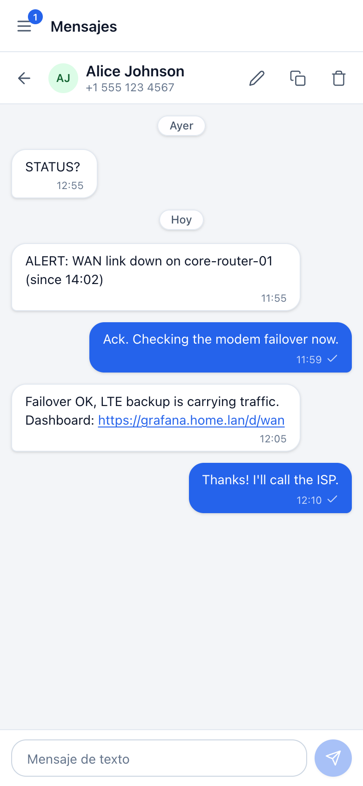 |

### Inicio de sesión

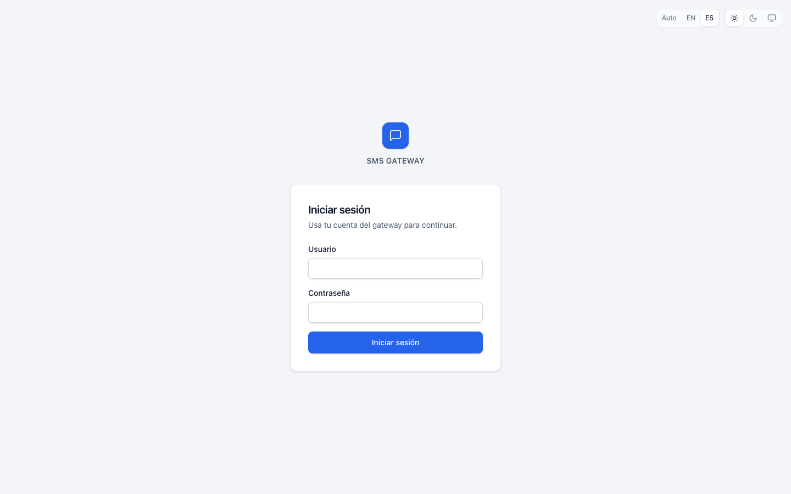

## Inicio rápido

### Requisitos previos

- Un módem GSM USB (por ejemplo, Huawei E220, SIM800)
- Go 1.25+ y Node.js 22+ (para compilar desde el código fuente)

### Instalación automática

El script de instalación te guía para configurar SMS Gateway como servicio de systemd. Descarga automáticamente la última versión publicada.

```bash
sudo bash -c "$(curl -fsSL https://raw.githubusercontent.com/mattboston/sms-gateway/main/install.sh)"
```

Esta forma descarga primero el script y se lo pasa a bash como argumento, de modo
que la entrada estándar sigue conectada a tu teclado y las preguntas interactivas
funcionan.

También puedes descargarlo y ejecutarlo a mano, lo que te permite leer el script antes:

```bash
curl -fsSL -o install.sh https://raw.githubusercontent.com/mattboston/sms-gateway/main/install.sh
chmod +x install.sh
sudo ./install.sh
```

Se te pedirá que elijas un método de instalación y la configuración (ruta del dispositivo, dirección de escucha, puerto y secreto JWT).

### Instalación manual: systemd

Descarga la última versión desde [GitHub Releases](https://github.com/mattboston/sms-gateway/releases) y configura el servicio a mano:

```bash
# Crear el usuario del servicio
sudo useradd -r -s /usr/sbin/nologin sms-gateway
sudo usermod -aG dialout sms-gateway

# Instalar el binario
sudo mkdir -p /opt/sms-gateway
sudo cp sms-gateway-linux-amd64 /opt/sms-gateway/sms-gateway
sudo chmod 755 /opt/sms-gateway/sms-gateway

# Configurar (edítalo según tu instalación)
sudo cp deploy/systemd/sms-gateway.conf /opt/sms-gateway/
sudo chmod 600 /opt/sms-gateway/sms-gateway.conf
sudo chown -R sms-gateway:sms-gateway /opt/sms-gateway

# Instalar la unidad de systemd
sudo cp deploy/systemd/sms-gateway.service /etc/systemd/system/
sudo systemctl daemon-reload
sudo systemctl enable --now sms-gateway
```

La unidad y un ejemplo de configuración están en [`deploy/systemd/`](deploy/systemd/).

### Instalación manual: binario precompilado

```bash
chmod +x sms-gateway-linux-amd64
./sms-gateway-linux-amd64 serve --device-path /dev/ttyUSB0 --jwt-secret "$JWT_SECRET"
```

`JWT_SECRET` debe tener al menos 32 caracteres; genéralo una vez con `openssl rand -base64 32` y consérvalo, porque si cambia se cierra la sesión de todos los usuarios.

### Desde el código fuente

```bash
# Instalar dependencias
just init

# Compilar
just build

# Ejecutar (modo desarrollo con módem simulado)
just dev

# Ejecutar (producción con módem real)
./bin/sms-gateway serve --device-path /dev/ttyUSB0 --jwt-secret "$JWT_SECRET"
```

### Docker Compose

Descarga y ejecuta el contenedor de producción:

```bash
docker compose pull
docker compose up -d
```

El [`docker-compose.yml`](docker-compose.yml) incluido usa por defecto la imagen publicada en GHCR, pasa la configuración mediante variables de entorno, guarda el estado de la aplicación en un volumen con nombre montado en `/opt/sms-gateway` y expone el árbol `/dev` del host con una regla de cgroup para dispositivos `ttyUSB`, de modo que el contenedor pueda abrir `/dev/ttyUSB*`.

Ejemplo mínimo:

```bash
grep -q '^JWT_SECRET=' .env 2>/dev/null || echo "JWT_SECRET=$(openssl rand -base64 32)" >> .env
DEVICE_PATH=/dev/ttyUSB0 \
IMAGE_VERSION=latest \
docker compose up -d
```

Notas importantes:

- `JWT_SECRET` es obligatorio: Compose no arranca sin él. Guardarlo en `.env` hace que todos los comandos `docker compose` usen el mismo valor.
- Las imágenes se publican en `ghcr.io/mattboston/sms-gateway` con la misma etiqueta de versión que los binarios.
- Asigna a `IMAGE_VERSION` una versión como `0.0.1`, o déjalo en `latest`.
- `DEVICE_PATH` debe apuntar al dispositivo del módem en el host, por ejemplo `/dev/ttyUSB0`.
- El montaje `/dev:/dev` es intencionado: si al reconectarse el módem pasa de `/dev/ttyUSB0` a otro `/dev/ttyUSB*`, no hace falta editar el archivo de Compose.
- Si tu host de Docker aplica restricciones de dispositivos adicionales a las reglas de cgroup por defecto, puede que necesites permisos específicos del host.

## Inicio de sesión por defecto

En el primer arranque se crea una cuenta `admin` con una contraseña aleatoria, que se muestra una sola vez en el log del servidor:

```text
Admin login: username admin, password <random>
```

Consúltala con `sudo journalctl -u sms-gateway` (systemd) o `docker compose logs sms-gateway` (Docker). Debes cambiarla en el primer inicio de sesión; hasta entonces la API solo permite cambiar la contraseña o cerrar sesión.

Las instalaciones de versiones anteriores cuyo administrador aún tenga la antigua contraseña por defecto `admin123` reciben del mismo modo una contraseña aleatoria nueva al actualizar.

## Interfaz web

Abre la interfaz en `http://localhost:5174` e inicia sesión con una cuenta de administrador. La barra lateral agrupa las páginas en **Mensajería** y **Configuración**.

| Página | Para qué sirve |
|--------|----------------|
| **Panel** | Estado del módem, intensidad de señal, totales de enviados/recibidos, formulario de envío rápido y mensajes recientes. |
| **Mensajes** | Todas las conversaciones agrupadas por número. Abre una para leer y responder, renombrar el contacto, copiar el número o eliminar la conversación. **Nuevo mensaje** inicia una conversación con cualquier número. Los envíos fallidos se pueden reintentar desde la conversación. |
| **Contactos** | Busca, crea, renombra y elimina nombres de contacto. Eliminar un contacto conserva sus mensajes. |
| **Claves API** | Crea claves para integraciones externas (por ejemplo, OpenClaw) y luego desactívalas o elimínalas. La clave solo se muestra una vez. |
| **Webhooks** | Solo administradores. Crea, edita, pausa, reanuda y elimina webhooks. Consulta [Webhooks](#webhooks). |
| **Usuarios** | Solo administradores. Crea usuarios, concede permisos de administrador y elimina usuarios no administradores. |
| **Prueba de módem** | Solo administradores. Estado del módem, señal y consola AT. |

Consejos:

- Usa **Mensajes → Nuevo mensaje** o el envío rápido del panel para mandar un mensaje de prueba; el número necesita el código de país (por ejemplo, `+34 612 34 56 78`).
- El número de no leídos aparece en la entrada **Mensajes** del menú, en el botón de menú en móvil y en el título de la pestaña del navegador.
- Abre **Preferencias** (el icono de controles deslizantes junto a tu usuario, al pie de la barra lateral) para cambiar idioma y tema. La página de inicio de sesión tiene los mismos controles en la esquina superior derecha. La elección se recuerda en el navegador.
- En escritorio puedes plegar la barra lateral a una columna de iconos con el botón de su cabecera, o arrastrar su borde derecho para cambiar el ancho (doble clic en el borde para restablecerlo). En móvil la barra lateral se convierte en un panel deslizable.
- Los enlaces antiguos `/inbox`, `/outbox` y `/send` redirigen a la vista Mensajes.

### Consola AT

La página **Prueba de módem** incluye una consola para comandos AT:

- Escribe un comando o búscalo por nombre (por ejemplo `csq` o `signal`); las sugerencias vienen de una referencia integrada y de los comandos que el módem informa con `AT+CLAC`.
- Una ficha de referencia bajo el campo muestra la sintaxis, los parámetros y el formato de respuesta del comando seleccionado.
- Las respuestas de los comandos y códigos de error más comunes se interpretan en lenguaje sencillo (por ejemplo, señal en dBm, operador y tipo de red).
- Los botones rápidos ejecutan comandos de solo lectura como `ATI`, `AT+CSQ`, `AT+CREG?` y `AT+COPS?`.
- `Tab` autocompleta, las flechas recorren sugerencias o comandos anteriores y `Esc` cierra la lista.
- El registro se guarda en el navegador (últimas 200 entradas) y cada entrada se puede volver a ejecutar.
- El servidor valida los comandos: una sola línea de ASCII imprimible que empiece por `AT`. Los comandos peligrosos (apagar la radio, restablecer de fábrica, borrar SMS, introducir el PIN, ...) y los no reconocidos piden confirmación antes de enviarse.

## Integración con OpenClaw

Usa la skill y los scripts de OpenClaw incluidos en [`openclaw/`](openclaw/) para enviar y recibir SMS desde OpenClaw.

1. Copia los archivos de la skill a tu espacio de trabajo de OpenClaw:

   ```bash
   mkdir -p ~/.openclaw/workspace/skills/sms-gateway
   cp -R openclaw/* ~/.openclaw/workspace/skills/sms-gateway/
   ```

2. Crea el archivo de entorno de los scripts:

   ```bash
   cp ~/.openclaw/workspace/skills/sms-gateway/scripts/.env.example ~/.openclaw/workspace/skills/sms-gateway/scripts/.env
   ```

3. Inicia sesión en la interfaz web de SMS Gateway.
4. Ve a Claves API y crea una clave nueva.
5. Asigna esa clave a `SMS_GATEWAY_API_KEY` en `~/.openclaw/workspace/skills/sms-gateway/scripts/.env`.
6. Actualiza `~/.openclaw/workspace/skills/sms-gateway/scripts/allowlist.json` con los nombres y números permitidos.
7. Prueba el envío:

   ```bash
   cd ~/.openclaw/workspace/skills/sms-gateway/scripts
   ./send_sms.sh "+15551234567" "Test message from OpenClaw"
   ```

8. Reinicia OpenClaw para que cargue la nueva skill y su configuración.
9. En OpenClaw, pídele que envíe un SMS a un usuario de tu lista de permitidos.
10. Pídele a OpenClaw que revise los SMS entrantes cada minuto.

Formato de ejemplo de `allowlist.json`:

```json
{
  "users": [
    {
      "name": "Alice Example",
      "phone": "+15551234567"
    }
  ]
}
```

## Configuración

La configuración se hace mediante un archivo de configuración, opciones de la CLI o variables de entorno.

| Opción | Variable de entorno | Por defecto | Descripción |
|--------|---------------------|-------------|-------------|
| `--host` | `HOST` | `127.0.0.1` | Dirección de escucha del servidor HTTP. Usa `0.0.0.0` para aceptar conexiones de otras máquinas (la imagen Docker usa `0.0.0.0`) |
| `--port` | `PORT` | `5174` | Puerto del servidor HTTP |
| `--db-driver` | `DB_DRIVER` | `sqlite` | Driver de base de datos (`sqlite` o `postgres`) |
| `--db-dsn` | `DB_DSN` | `/opt/sms-gateway/sms-gateway.db` | Cadena de conexión a la base de datos |
| `--config-file` | `CONFIG_FILE` | `/opt/sms-gateway/sms-gateway.conf` | Ruta del archivo de configuración |
| `--device-path` | `DEVICE_PATH` | | Ruta del dispositivo serie (por ejemplo, `/dev/ttyUSB0`) |
| `--baud-rate` | `BAUD_RATE` | `9600` | Velocidad en baudios |
| `--jwt-secret` | `JWT_SECRET` | (obligatorio) | Secreto para firmar JWT, de al menos 32 caracteres. En modo desarrollo se genera uno aleatorio si no se define |
| `--dev-mode` | `DEV_MODE` | `false` | Activa el modo desarrollo (módem simulado, CORS) |

Hay un archivo de configuración de ejemplo en [`deploy/systemd/sms-gateway.conf`](deploy/systemd/sms-gateway.conf).

## Comandos de la CLI

```bash
# Iniciar el servidor
sms-gateway serve [flags]

# Migraciones de base de datos
sms-gateway migrate up
sms-gateway migrate down
sms-gateway migrate status

# Gestión de usuarios
sms-gateway user create --username alice --password secret --admin

# Gestión de claves API
sms-gateway apikey create --label "my-app" --user-id <uuid>
sms-gateway apikey list
sms-gateway apikey revoke --id <uuid>
```

## API

La documentación interactiva de la API está disponible en `/swagger/index.html` con el servidor en marcha. La especificación generada está en [`src/docs/`](src/docs/).

### Autenticación

**JWT (interfaz web):** haz un POST a `/api/v1/auth/login` con usuario y contraseña para obtener un token y envíalo como `Authorization: Bearer <token>`.

**Clave API:** incluye la cabecera `X-API-Key: <clave>` en las peticiones.

### Enviar un mensaje

```bash
curl -X POST http://localhost:5174/api/v1/sms/send \
  -H "X-API-Key: $SMS_GATEWAY_API_KEY" \
  -H "Content-Type: application/json" \
  -d '{"to": "+34612345678", "body": "El disco de nas-01 supera el 90%"}'
```

`to` debe ser un número internacional con `+` y código de país (se ignoran espacios, guiones, puntos y paréntesis) o un código corto de 3 a 6 dígitos; cualquier otro número se rechaza con `400`. `body` admite hasta 918 caracteres y se divide automáticamente en partes concatenadas.

### Endpoints

| Método | Ruta | Autenticación | Descripción |
|--------|------|---------------|-------------|
| GET | `/api/v1/health` | Ninguna | Comprobación de salud |
| POST | `/api/v1/auth/login` | Ninguna | Iniciar sesión |
| POST | `/api/v1/auth/logout` | JWT | Cerrar sesión |
| POST | `/api/v1/auth/change-password` | JWT | Cambiar tu contraseña |
| POST | `/api/v1/sms/send` | JWT o clave API | Enviar SMS |
| GET | `/api/v1/sms/inbox` | JWT o clave API | Listar mensajes recibidos (`status`, `all`, `limit`, `offset`) |
| GET | `/api/v1/sms/outbox` | JWT o clave API | Listar mensajes enviados (`limit`, `offset`) |
| GET | `/api/v1/sms/stats` | JWT o clave API | Recuento de mensajes por dirección y estado |
| GET | `/api/v1/sms/{id}` | JWT o clave API | Obtener un mensaje por ID |
| PUT | `/api/v1/sms/{id}/read` | JWT o clave API | Marcar mensaje como leído |
| PUT | `/api/v1/sms/{id}/unread` | JWT o clave API | Marcar mensaje como no leído |
| DELETE | `/api/v1/sms/{id}` | JWT o clave API | Eliminar un mensaje |
| GET | `/api/v1/sms/conversations` | JWT o clave API | Listar conversaciones (`q`, `limit`, `offset`) |
| GET | `/api/v1/sms/conversations/messages` | JWT o clave API | Mensajes de una conversación (`phone`, `limit`, `before_id`) |
| PUT | `/api/v1/sms/conversations/read` | JWT o clave API | Marcar una conversación como leída (`phone`) |
| DELETE | `/api/v1/sms/conversations` | JWT o clave API | Eliminar una conversación (`phone`) |
| GET | `/api/v1/contacts` | JWT o clave API | Listar contactos (`q`, `limit`, `offset`) |
| PUT | `/api/v1/contacts` | JWT o clave API | Crear o renombrar un contacto (`phone`, cuerpo `{"name": "..."}`) |
| DELETE | `/api/v1/contacts` | JWT o clave API | Eliminar el nombre de un contacto (`phone`); los mensajes se conservan |
| GET | `/api/v1/modem/status` | JWT o clave API | Estado del módem |
| GET | `/api/v1/modem/signal` | JWT o clave API | Intensidad de señal |
| POST | `/api/v1/modem/at` | JWT + admin | Enviar un comando AT (`{"command": "...", "confirm": false}`) |
| GET | `/api/v1/modem/at/commands` | JWT + admin | Referencia de comandos AT y comandos que admite el módem |
| GET | `/api/v1/apikeys` | JWT | Listar claves API |
| POST | `/api/v1/apikeys` | JWT | Crear clave API |
| DELETE | `/api/v1/apikeys/{id}` | JWT | Desactivar clave API |
| DELETE | `/api/v1/apikeys/{id}/delete` | JWT | Eliminar clave API |
| GET | `/api/v1/users` | JWT + admin | Listar usuarios |
| POST | `/api/v1/users` | JWT + admin | Crear usuario |
| DELETE | `/api/v1/users/{id}` | JWT + admin | Eliminar un usuario no administrador |
| GET | `/api/v1/webhooks` | JWT + admin | Listar webhooks |
| POST | `/api/v1/webhooks` | JWT + admin | Crear webhook |
| PUT | `/api/v1/webhooks/{id}` | JWT + admin | Actualizar, pausar o reanudar un webhook |
| DELETE | `/api/v1/webhooks/{id}` | JWT + admin | Eliminar webhook |

Notas:

- Los endpoints que reciben `phone` lo leen de la query string, codificado para URL (`?phone=%2B34612345678`).
- `POST /api/v1/modem/at` responde `409` con un aviso para comandos peligrosos o no reconocidos; reenvíalo con `"confirm": true` para ejecutarlo. Las formas de lectura (`?`) y de prueba (`=?`) siempre se permiten.
- Eliminar un usuario elimina también sus claves API; los mensajes enviados con esas claves se conservan. Las cuentas de administrador no se pueden eliminar.

## Webhooks

Los webhooks envían los eventos de mensajes a tu propio endpoint HTTP en cuanto
ocurren, así las integraciones no tienen que consultar la bandeja de entrada
periódicamente. Los administradores los gestionan en la página **Webhooks** de la
interfaz o mediante los endpoints `/api/v1/webhooks`.

Cada webhook tiene:

- **Nombre**: una etiqueta para identificarlo.
- **URL de entrega**: una URL absoluta `http` o `https` que recibe un `POST` por
  cada evento suscrito. Se permiten direcciones de la red local, ya que los
  receptores autoalojados son habituales.
- **Secreto de firma**: la clave HMAC con la que se firman las entregas. Déjalo en
  blanco para que se genere un secreto `whsec_...`. Debe tener al menos 16
  caracteres.
- **Eventos**: uno o varios de los siguientes.

| Evento | Se dispara cuando |
|--------|-------------------|
| `message.received` | Se recibe y guarda un SMS entrante |
| `message.sent` | El módem acepta un SMS saliente |
| `message.failed` | El módem rechaza un SMS saliente |

### Contenido

Cada entrega es un `POST` JSON. `data` es el mensaje tal como lo devuelve
`GET /api/v1/sms/{id}`:

```json
{
  "id": "0f9b3c2e-6a51-4d7e-9a43-3c1f0e2b8d11",
  "event": "message.received",
  "created_at": "2026-10-02T16:01:23.512Z",
  "data": {
    "id": "9918b2a1-59e3-4847-a9a7-e6d02bd32d7b",
    "direction": "inbound",
    "phone_number": "+15551234567",
    "body": "Hello",
    "status": "received",
    "created_at": "2026-10-02T16:01:23Z",
    "updated_at": "2026-10-02T16:01:23Z"
  }
}
```

Cabeceras de la petición:

| Cabecera | Valor |
|----------|-------|
| `X-Webhook-Id` | El id del evento, igual al `id` del cuerpo. Los reintentos lo reutilizan, así que úsalo para descartar duplicados. |
| `X-Webhook-Event` | El nombre del evento, por ejemplo `message.received` |
| `X-Webhook-Timestamp` | Hora Unix en segundos en la que se firmó este intento |
| `X-Webhook-Signature` | `sha256=` seguido del HMAC-SHA256 en hexadecimal de `<timestamp>.<cuerpo sin procesar>` |

### Verificar firmas

Recalcula la firma sobre el cuerpo sin procesar, antes de parsear el JSON,
compárala en tiempo constante y rechaza marcas de tiempo de hace más de unos
minutos para evitar reenvíos. Ejemplo en Node.js:

```js
import crypto from 'node:crypto';

function verifyWebhook(secret, headers, rawBody) {
  const timestamp = headers['x-webhook-timestamp'];
  if (Math.abs(Date.now() / 1000 - Number(timestamp)) > 300) return false;

  const expected =
    'sha256=' +
    crypto.createHmac('sha256', secret).update(`${timestamp}.${rawBody}`).digest('hex');
  const received = headers['x-webhook-signature'] ?? '';
  return (
    expected.length === received.length &&
    crypto.timingSafeEqual(Buffer.from(expected), Buffer.from(received))
  );
}
```

### Entrega y reintentos

- Cualquier respuesta `2xx` cuenta como entregada. Todo lo demás, incluidas las
  redirecciones (que nunca se siguen), los tiempos de espera de 10 segundos y los
  errores de conexión, se reintenta tras 5 segundos, 30 segundos y 2 minutos, con
  un máximo de 4 intentos.
- Las entregas se hacen en segundo plano y nunca retrasan la recepción ni el envío
  de SMS.
- Las entregas pendientes solo se guardan en memoria: las que esperan un reintento
  cuando el servicio se detiene se pierden. Usa `GET /api/v1/sms/inbox` para
  conciliar si tu receptor estuvo caído.
- Los webhooks pausados no reciben nada hasta que se reanudan.

## Desarrollo

Antes de contribuir, revisa [`CONTRIBUTING.md`](CONTRIBUTING.md) (en inglés) para conocer el nombrado de ramas, los requisitos de conventional commits, la configuración de hooks (`just init`) y lo que se espera de los pull requests.

### Requisitos previos

- Go 1.25+
- Node.js 22+
- [Just](https://github.com/casey/just) como ejecutor de comandos

### Comandos

```bash
just dev            # Servidores de desarrollo de backend y frontend
just build          # Compilar el binario de producción
just test           # Ejecutar los tests de Go
just lint           # Ejecutar todos los linters
just format         # Ejecutar todos los formateadores
just swagger        # Regenerar la documentación de Swagger
just migrate-new X  # Crear una migración llamada X
```

`just dev` arranca la API con un módem simulado en el puerto `5174` y el servidor de desarrollo de Vite (por defecto `http://localhost:5173`), que redirige `/api` y `/swagger` a la API.

### Traducciones

Los textos de la interfaz están en [`src/web/src/locales/`](src/web/src/locales/): [`en.ts`](src/web/src/locales/en.ts) es el diccionario de referencia y [`es.ts`](src/web/src/locales/es.ts) debe definir las mismas claves. Para añadir un idioma, crea su diccionario ahí y regístralo en [`src/web/src/lib/i18n.tsx`](src/web/src/lib/i18n.tsx).

### Estructura del proyecto

```
src/
  cmd/sms-gateway/    # Punto de entrada de la CLI
  internal/
    api/              # Handlers HTTP, router, middleware, límite de inicios de sesión
    auth/             # JWT, bcrypt, generación de claves API
    config/           # Carga de configuración
    database/         # Conexión, repositorio y migraciones
    models/           # Tipos de dominio y modelos de petición/respuesta
    modem/            # Interfaz serie/AT, codificación PDU, catálogo AT y módem simulado
    webhook/          # Entrega firmada de webhooks y reintentos
  web/                # Frontend React (Vite + TypeScript + Tailwind)
    src/components/   # Layout, UI compartida, chat y consola AT
    src/lib/          # Cliente API, autenticación, i18n, tema y hooks
    src/locales/      # Diccionarios en inglés y español
    src/pages/        # Panel, Mensajes, Contactos, Claves API, Webhooks, Usuarios, Prueba de módem
  migrations/         # Migraciones SQL de Goose
  docs/               # Documentación de Swagger generada
deploy/               # Unidad de systemd y configuración de ejemplo
openclaw/             # Skill y scripts de OpenClaw
docs/images/          # Imágenes y capturas del README
```

## Licencia

GPL-3.0. Consulta [`LICENSE`](LICENSE).
