# SMS Gateway

**English** | [Español](README.es.md)

A self-hosted SMS gateway that provides a WebUI and REST API for sending and receiving SMS messages via a USB GSM modem. Built with Go and React, packaged as a single binary.

> **Fork notice:** this repository is a modified version of [mattboston/sms-gateway](https://github.com/mattboston/sms-gateway), created by Matt Shields. Credit for the original project goes to its author. This fork adds the changes listed in [Changes in this fork](#changes-in-this-fork) and is distributed under the same [GPL-3.0 license](LICENSE). See [Credits and license](#credits-and-license).

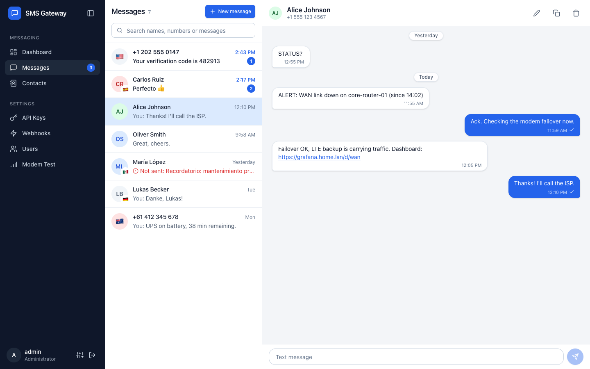

## Contents

- [Why SMS Gateway?](#why-sms-gateway)
- [Features](#features)
- [Hardware Requirements](#hardware-requirements)
- [Screenshots](#screenshots)
- [Quick Start](#quick-start)
- [Default Login](#default-login)
- [Web UI](#web-ui)
- [OpenClaw Integration](#openclaw-integration)
- [Configuration](#configuration)
- [CLI Commands](#cli-commands)
- [API](#api)
- [Webhooks](#webhooks)
- [Development](#development)
- [Credits and license](#credits-and-license)

## Why SMS Gateway?

Plenty of cloud services will rent you a number for sending and receiving SMS.
Actually getting one working is another story: A2P 10DLC brand and campaign
registration, use case vetting, approved message templates, per-segment billing,
and the standing risk of carrier filtering or suspension. For a home lab, a small
business alerting setup, or a side project, that is a lot of paperwork to send a
text message.

This project takes the other path. Plug a USB GSM modem into a machine, insert a
SIM card with an SMS plan, and you have your own gateway. No registration, no
vetting, no per-message pricing, no vendor between you and your messages.

### Your alerts still get through when your internet does not

This is the big one. Monitoring software that depends on a cloud SMS provider
needs working internet to tell you that your internet is broken. When the WAN
link drops at your house or your rack loses upstream connectivity, the exact
moment you most need an alert is the moment your notification path disappears.

A USB GSM modem sends over the cellular network, which is a completely
independent path from your ISP. As long as you have cell coverage, messages keep
flowing in both directions. Your monitoring stack can page you about the outage
while it is happening, and you can text a command back to check status or kick
off a runbook.

### Other reasons to self-host

- **Own your data.** Messages live in your own SQLite or PostgreSQL database, not
  in a vendor's dashboard with a retention policy you do not control.
- **Predictable cost.** A flat monthly SIM plan instead of per-segment billing
  that scales with how noisy your alerts get.
- **No content filtering.** Carriers and aggregators routinely filter A2P traffic.
  Messages from a consumer SIM are far less likely to silently vanish.
- **Privacy.** Message content never transits a third party.
- **Simple integration.** A REST API with API keys works with anything that can
  make an HTTP request, from a shell script to Prometheus Alertmanager to an
  AI agent.
- **Cheap hardware.** A Raspberry Pi, a dongle, and a SIM is the whole bill of
  materials.

## Features

**Messaging**

- Send and receive SMS messages through a USB GSM modem
- Chat-style **Messages** view: messages grouped into conversations by phone number, with unread badges, search by name, number or text, day separators, delivery status, retry for failed sends and history paging
- Long messages (up to 918 characters) are sent as concatenated SMS in PDU mode, so the phone shows them as a single message; non-GSM text (emoji, accents outside the GSM alphabet) is encoded as UCS-2 automatically
- International phone input: the `+` is added for you, numbers are formatted as you type and the country is detected from the calling code (flag and name)
- Recipients must be in international E.164 format (`+` and country code) or a 3-6 digit short code, so every conversation stores numbers the same way
- **Contacts**: give phone numbers a display name, edit it inline from the conversation header, and manage all names from the Contacts page
- Selectable message text and clickable `http(s)` links in message bodies
- Background activity watcher: one lightweight poll keeps the unread badge, dashboard, conversation list and open thread up to date, and shows the unread count in the browser tab title

**Administration**

- REST API with JWT and API key authentication
- API key management for programmatic access (deactivate or delete keys)
- Signed webhooks for real-time notifications on received, sent and failed messages
- User management with admin roles; admins can delete non-admin users (admin accounts are protected)
- **Modem Test** page with modem status, signal strength and an **AT console**: autocomplete, a built-in AT command reference (V.250, 3GPP TS 27.007/27.005), plain-language decoding of responses, quick commands, a persistent terminal-style log, and confirmation for risky commands
- Login throttling and a forced password change for the generated admin account

**Web UI**

- Responsive React interface that works on phones, tablets and desktops
- English and Spanish translations, with automatic detection from the browser language
- Light, dark and system themes
- Collapsible and resizable navigation sidebar; a **Preferences** panel groups language and theme
- In-app confirmation dialogs for destructive actions

**Deployment**

- Health check endpoint for monitoring
- SQLite (default) or PostgreSQL database
- Interactive Swagger API documentation at `/swagger/`
- Single binary deployment (frontend embedded via `go:embed`)
- Cross-platform: Linux x86_64, macOS ARM64, Raspberry Pi
- Docker image published to GHCR

## Hardware Requirements

To run SMS Gateway, you need a USB GSM modem and an active SIM card with SMS capabilities.

### USB GSM Modem

The original author uses and recommends the [SIM7600G-H 4G LTE USB Dongle](https://www.amazon.com/dp/B0BHQFTFPH?tag=mattboston-20). It supports global 4G LTE bands, works out of the box on Linux (including Raspberry Pi), and exposes a standard serial interface for AT commands. For detailed documentation, pinout diagrams, and troubleshooting, see the [Waveshare SIM7600G-H wiki](https://www.waveshare.com/wiki/SIM7600G-H_4G_DONGLE).


### SIM Card

Any SIM card with an active SMS plan will work. The original author uses [Tello](https://tello.com/account/register?_referral=P30KX3Z2), which offers affordable pay-as-you-go plans on the T-Mobile network, for about $8/month with unlimited SMS.

> **Note:** The links above are the original author's referral links and are kept unchanged. Using them supports the development of the original project.
>
> To support the original project further, see the author's [Amazon Wish List](https://www.amazon.com/hz/wishlist/ls/T3L6QCKZJ4Q4?ref_=wl_share).

## Screenshots

Screenshots of the Spanish interface are in the [Spanish README](README.es.md#capturas-de-pantalla).

### Dashboard

Modem status, signal, message totals, quick send and recent messages.

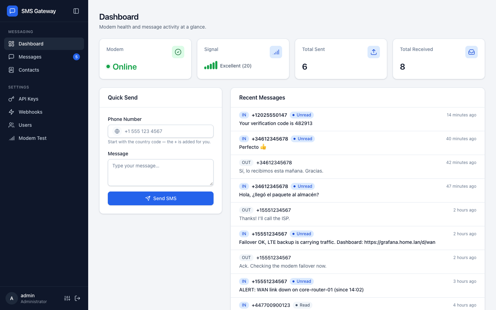

### Messages

Conversations on the left, the open thread on the right. Inbound and outbound messages, delivery status, links and contact names.


### New message

International phone input with country detection and number validation.

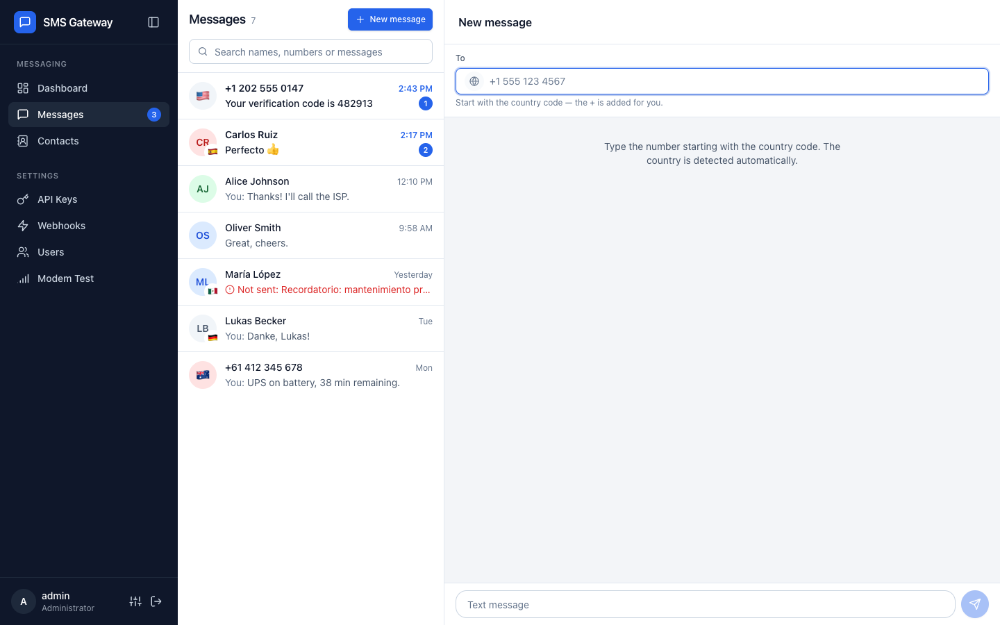

### Contacts

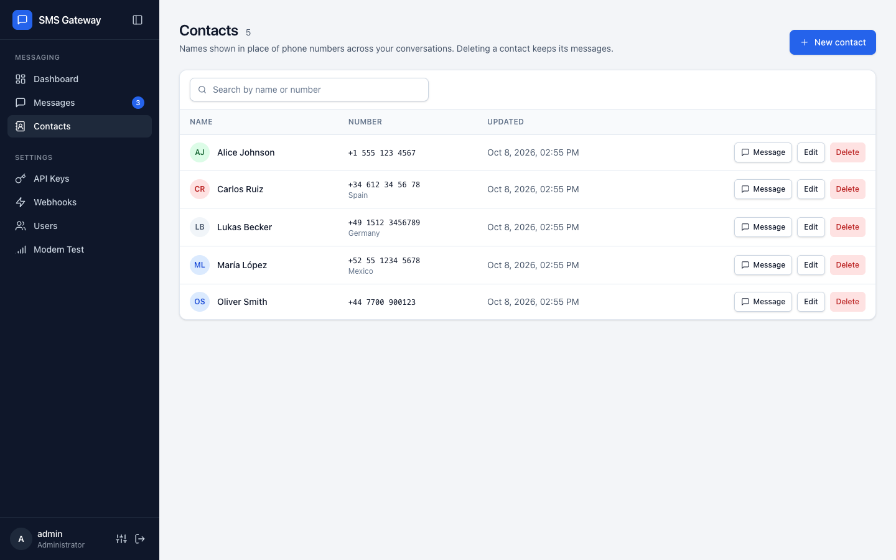

### API Keys

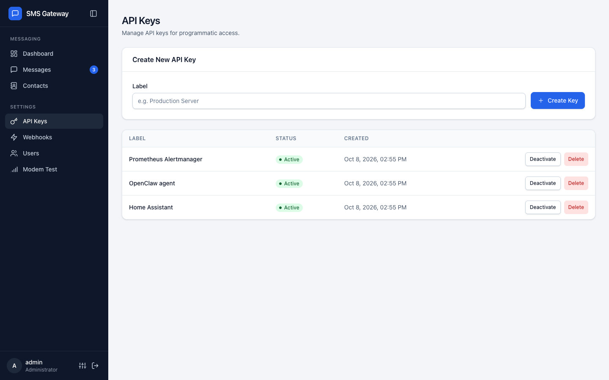

### Webhooks

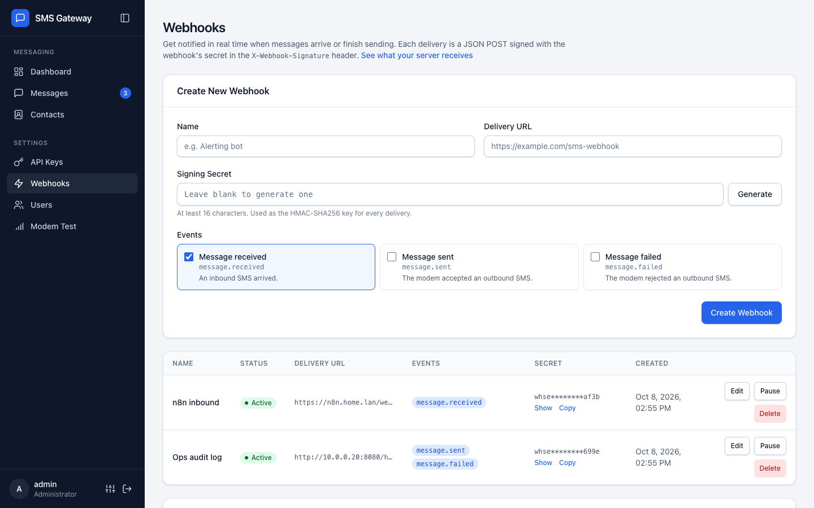

### Users

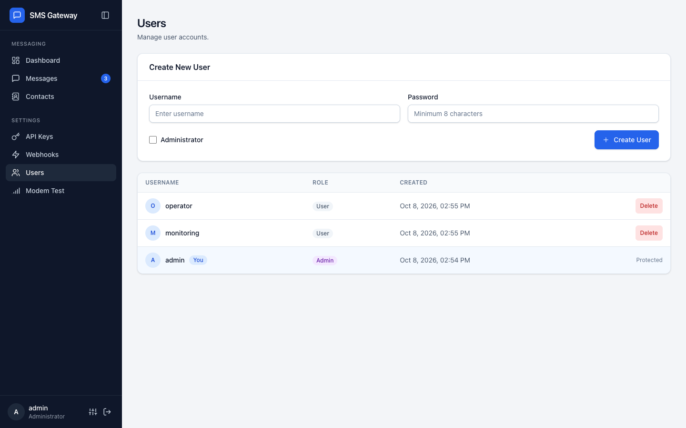

### Modem Test and AT console

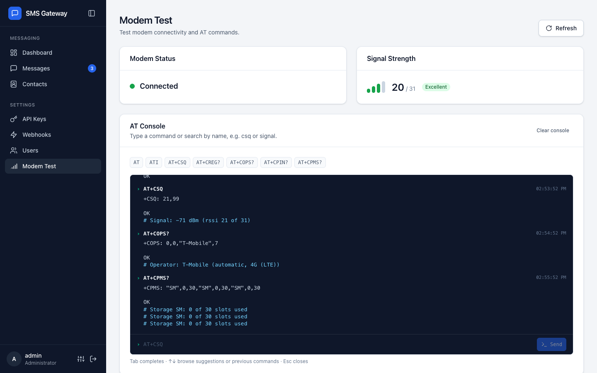

### Preferences

Language (Auto, English, Spanish) and theme (Light, Dark, System).

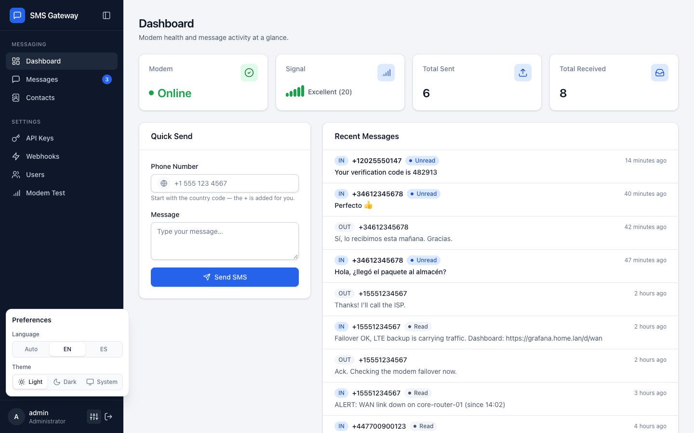

### Dark theme

| Dashboard | Messages |
|-----------|----------|
| 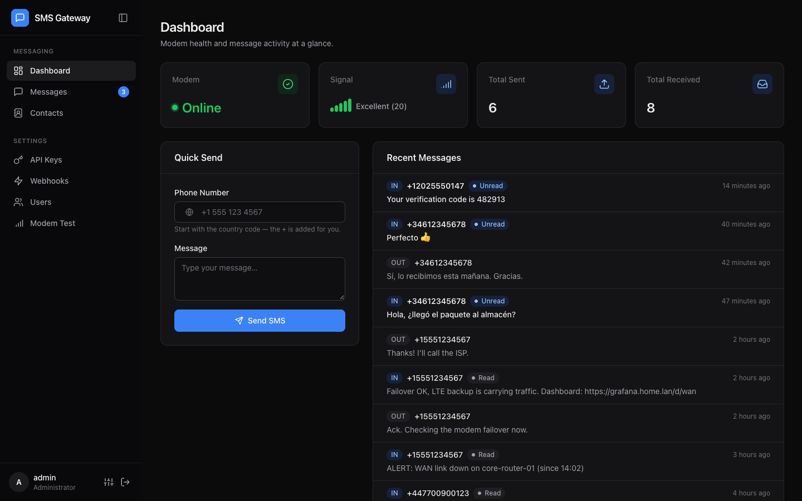 | 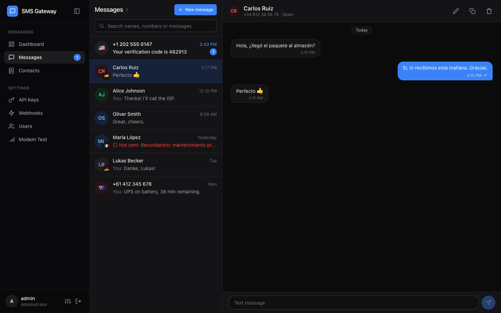 |

### Mobile

| Dashboard | Conversations | Thread |
|-----------|---------------|--------|
| 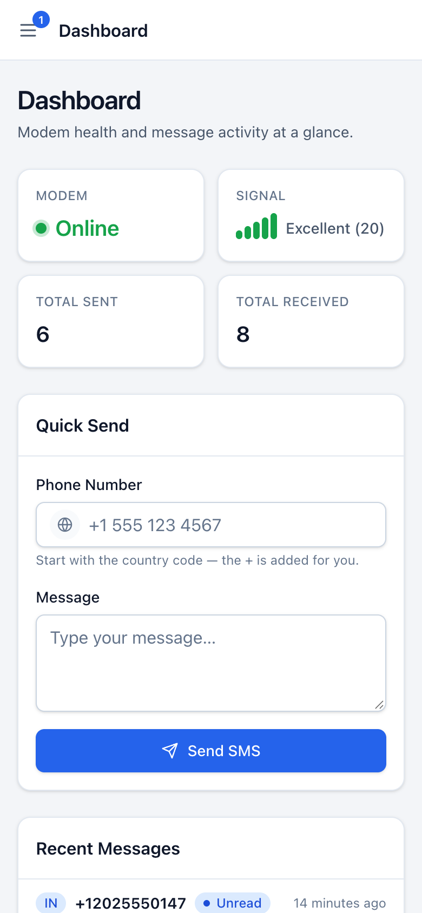 | 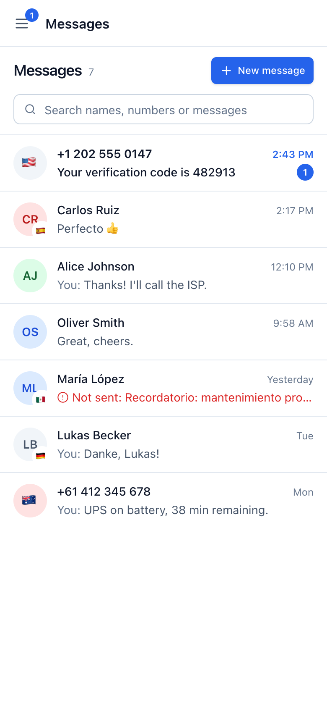 | 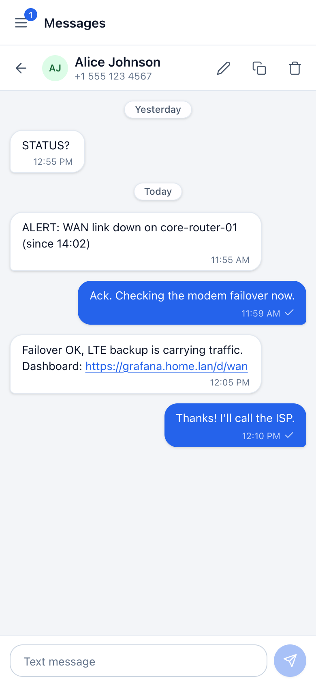 |

### Sign in

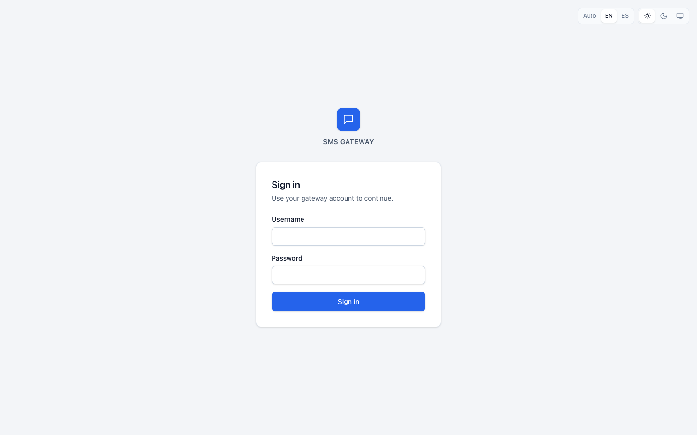

## Quick Start

### Prerequisites

- A USB GSM modem (e.g., Huawei E220, SIM800)
- Go 1.25+ and Node.js 22+ (for building from source)

> **Releases come from the original project.** The install script, the GitHub Releases link and the `ghcr.io/mattboston/sms-gateway` image below download builds published by [mattboston/sms-gateway](https://github.com/mattboston/sms-gateway). They do not include changes from this fork that have not been merged upstream; to run this fork, build it [from source](#from-source) or build the Docker image locally (`docker build -t sms-gateway:local .`).

### Automated Install

The install script will guide you through setting up SMS Gateway as a systemd service. It fetches the latest release automatically.

```bash
sudo bash -c "$(curl -fsSL https://raw.githubusercontent.com/mattboston/sms-gateway/main/install.sh)"
```

This form downloads the script first and passes it to bash as an argument, which
leaves stdin connected to your keyboard so the interactive prompts work.

Or download and run manually, which also lets you read the script before running it:

```bash
curl -fsSL -o install.sh https://raw.githubusercontent.com/mattboston/sms-gateway/main/install.sh
chmod +x install.sh
sudo ./install.sh
```

You will be prompted to choose an install method and provide configuration (device path, listen address, port, JWT secret).

### Manual Install: Systemd

Download the latest release from [GitHub Releases](https://github.com/mattboston/sms-gateway/releases) and set up the service manually:

```bash
# Create service user
sudo useradd -r -s /usr/sbin/nologin sms-gateway
sudo usermod -aG dialout sms-gateway

# Install binary
sudo mkdir -p /opt/sms-gateway
sudo cp sms-gateway-linux-amd64 /opt/sms-gateway/sms-gateway
sudo chmod 755 /opt/sms-gateway/sms-gateway

# Configure (edit to match your setup)
sudo cp deploy/systemd/sms-gateway.conf /opt/sms-gateway/
sudo chmod 600 /opt/sms-gateway/sms-gateway.conf
sudo chown -R sms-gateway:sms-gateway /opt/sms-gateway

# Install systemd unit
sudo cp deploy/systemd/sms-gateway.service /etc/systemd/system/
sudo systemctl daemon-reload
sudo systemctl enable --now sms-gateway
```

See [`deploy/systemd/`](deploy/systemd/) for the unit file and an example configuration.

### Manual Install: Pre-built Binary

```bash
chmod +x sms-gateway-linux-amd64
./sms-gateway-linux-amd64 serve --device-path /dev/ttyUSB0 --jwt-secret "$JWT_SECRET"
```

`JWT_SECRET` must be at least 32 characters; generate it once with `openssl rand -base64 32` and keep it, since changing it signs everyone out.

### From Source

```bash
# Install dependencies
just init

# Build
just build

# Run (development mode with mock modem)
just dev

# Run (production with real modem)
./bin/sms-gateway serve --device-path /dev/ttyUSB0 --jwt-secret "$JWT_SECRET"
```

### Docker Compose

Build and run the production container:

```bash
docker compose pull
docker compose up -d
```

The included [`docker-compose.yml`](docker-compose.yml) pulls the published GHCR image by default, passes configuration through environment variables, persists app state in a named volume mounted at `/opt/sms-gateway`, and exposes the host `/dev` tree with a `ttyUSB` device cgroup rule so the container can open `/dev/ttyUSB*`.

Minimal example:

```bash
grep -q '^JWT_SECRET=' .env 2>/dev/null || echo "JWT_SECRET=$(openssl rand -base64 32)" >> .env
DEVICE_PATH=/dev/ttyUSB0 \
IMAGE_VERSION=latest \
docker compose up -d
```

Important notes:

- `JWT_SECRET` is required: Compose refuses to start without it. Keeping it in `.env` gives every `docker compose` command the same value.
- Released container images are published to `ghcr.io/mattboston/sms-gateway` and tagged with the same version string as the release binaries.
- Set `IMAGE_VERSION` to a release tag such as `0.0.1`, or leave it at `latest`.
- `DEVICE_PATH` should point at the modem node on the host, for example `/dev/ttyUSB0`.
- The `/dev:/dev` bind is intentional so reconnects that change the modem from `/dev/ttyUSB0` to another `/dev/ttyUSB*` path do not require editing the Compose file.
- If your Docker host enforces extra device restrictions beyond the default cgroup rules, you may still need host-specific allowances.

## Default Login

On first start, an `admin` account is created with a random password, printed once in the server log:

```text
Admin login: username admin, password <random>
```

Read it with `sudo journalctl -u sms-gateway` (systemd) or `docker compose logs sms-gateway` (Docker). You must change it on first login; until then the API only allows changing the password or logging out.

Installs from earlier releases whose admin still has the old default password `admin123` get a new random password the same way on upgrade.

## Web UI

Open the WebUI at `http://localhost:5174` and sign in with an admin account. The sidebar groups pages into **Messaging** and **Settings**.

| Page | What it does |
|------|--------------|
| **Dashboard** | Modem status, signal strength, sent/received totals, a quick send form and the most recent messages. |
| **Messages** | All conversations, grouped by phone number. Open one to read and reply, rename the contact, copy the number or delete the conversation. **New message** starts a conversation with any number. Failed sends can be retried from the thread. |
| **Contacts** | Search, create, rename and delete contact names. Deleting a contact keeps its messages. |
| **API Keys** | Create keys for external integrations (for example, OpenClaw), then deactivate or delete them. The key is shown only once. |
| **Webhooks** | Admin only. Create, edit, pause, resume and delete webhooks. See [Webhooks](#webhooks). |
| **Users** | Admin only. Create users, grant admin rights and delete non-admin users. |
| **Modem Test** | Admin only. Modem status, signal and the AT console. |

Tips:

- Use **Messages → New message** or the dashboard quick send to send a test message; numbers need the country code (e.g. `+1 555 123 4567`).
- The unread count appears on the **Messages** nav item, on the mobile menu button and in the browser tab title.
- Open **Preferences** (the sliders icon next to your user in the sidebar footer) to switch language and theme. The sign-in page has the same controls in its top-right corner. Your choice is remembered in the browser.
- On desktop, collapse the sidebar to an icon rail with the button in its header, or drag its right edge to resize it (double-click the edge to reset). On phones the sidebar becomes a drawer.
- Old `/inbox`, `/outbox` and `/send` links redirect to the Messages view.

### AT console

The **Modem Test** page includes a console for raw AT commands:

- Type a command or search by name (e.g. `csq` or `signal`); suggestions come from a built-in command reference plus the commands your modem reports through `AT+CLAC`.
- A reference card below the input shows the syntax, parameters and response format of the selected command.
- Responses for common commands and error codes are decoded into plain language (e.g. signal in dBm, operator and network type).
- Quick buttons run read-only commands such as `ATI`, `AT+CSQ`, `AT+CREG?` and `AT+COPS?`.
- `Tab` completes, the arrow keys browse suggestions or previous commands, `Esc` closes the list.
- The log is kept in the browser (last 200 entries) and each entry can be run again.
- Commands are validated server-side: one line of printable ASCII starting with `AT`. Dangerous commands (radio off, factory reset, SMS deletion, PIN entry, ...) and commands that are not recognised ask for confirmation before they are sent.

## OpenClaw Integration

Use the bundled OpenClaw skill and scripts in [`openclaw/`](openclaw/) to send and receive SMS from OpenClaw.

1. Copy the OpenClaw skill files into your OpenClaw workspace:

   ```bash
   mkdir -p ~/.openclaw/workspace/skills/sms-gateway
   cp -R openclaw/* ~/.openclaw/workspace/skills/sms-gateway/
   ```

2. Create your script environment file:

   ```bash
   cp ~/.openclaw/workspace/skills/sms-gateway/scripts/.env.example ~/.openclaw/workspace/skills/sms-gateway/scripts/.env
   ```

3. Log in to the SMS Gateway WebUI.
4. Go to API Keys and create a new API key.
5. Set `SMS_GATEWAY_API_KEY` in `~/.openclaw/workspace/skills/sms-gateway/scripts/.env` to that new key.
6. Update `~/.openclaw/workspace/skills/sms-gateway/scripts/allowlist.json` with allowed names and phone numbers.
7. Test outbound messaging:

   ```bash
   cd ~/.openclaw/workspace/skills/sms-gateway/scripts
   ./send_sms.sh "+15551234567" "Test message from OpenClaw"
   ```

8. Restart OpenClaw so it picks up the new skill and config.
9. In OpenClaw, ask it to send an SMS message to a user in your allowlist.
10. Ask OpenClaw to check for incoming SMS messages every minute.

Example `allowlist.json` entry format:

```json
{
  "users": [
    {
      "name": "Alice Example",
      "phone": "+15551234567"
    }
  ]
}
```

## Configuration

Configuration is done via a config file, CLI flags, or environment variables.

| Flag | Env Var | Default | Description |
|------|---------|---------|-------------|
| `--host` | `HOST` | `127.0.0.1` | HTTP server listen address. Use `0.0.0.0` to accept connections from other machines (the Docker image sets `0.0.0.0`) |
| `--port` | `PORT` | `5174` | HTTP server port |
| `--db-driver` | `DB_DRIVER` | `sqlite` | Database driver (`sqlite` or `postgres`) |
| `--db-dsn` | `DB_DSN` | `/opt/sms-gateway/sms-gateway.db` | Database connection string |
| `--config-file` | `CONFIG_FILE` | `/opt/sms-gateway/sms-gateway.conf` | Path to config file |
| `--device-path` | `DEVICE_PATH` | | Serial device path (e.g., `/dev/ttyUSB0`) |
| `--baud-rate` | `BAUD_RATE` | `9600` | Serial baud rate |
| `--jwt-secret` | `JWT_SECRET` | (required) | JWT signing secret, at least 32 characters. Dev mode generates a random one when unset |
| `--dev-mode` | `DEV_MODE` | `false` | Enable dev mode (mock modem, CORS) |

An example config file is in [`deploy/systemd/sms-gateway.conf`](deploy/systemd/sms-gateway.conf).

## CLI Commands

```bash
# Start the server
sms-gateway serve [flags]

# Database migrations
sms-gateway migrate up
sms-gateway migrate down
sms-gateway migrate status

# User management
sms-gateway user create --username alice --password secret --admin

# API key management
sms-gateway apikey create --label "my-app" --user-id <uuid>
sms-gateway apikey list
sms-gateway apikey revoke --id <uuid>
```

## API

Interactive API documentation is available at `/swagger/index.html` when the server is running. The generated spec lives in [`src/docs/`](src/docs/).

### Authentication

**JWT (WebUI):** POST to `/api/v1/auth/login` with username/password to get a token, then send `Authorization: Bearer <token>`.

**API Key:** Include `X-API-Key: <key>` header in requests.

### Sending a message

```bash
curl -X POST http://localhost:5174/api/v1/sms/send \
  -H "X-API-Key: $SMS_GATEWAY_API_KEY" \
  -H "Content-Type: application/json" \
  -d '{"to": "+15551234567", "body": "Disk usage on nas-01 is above 90%"}'
```

`to` must be an international number with `+` and country code (spaces, dashes, dots and parentheses are ignored) or a 3-6 digit short code; other numbers are rejected with `400`. `body` can be up to 918 characters and is split into concatenated parts automatically.

### Endpoints

| Method | Path | Auth | Description |
|--------|------|------|-------------|
| GET | `/api/v1/health` | None | Health check |
| POST | `/api/v1/auth/login` | None | Login |
| POST | `/api/v1/auth/logout` | JWT | Logout |
| POST | `/api/v1/auth/change-password` | JWT | Change your password |
| POST | `/api/v1/sms/send` | JWT or API Key | Send SMS |
| GET | `/api/v1/sms/inbox` | JWT or API Key | List received messages (`status`, `all`, `limit`, `offset`) |
| GET | `/api/v1/sms/outbox` | JWT or API Key | List sent messages (`limit`, `offset`) |
| GET | `/api/v1/sms/stats` | JWT or API Key | Message counts by direction and status |
| GET | `/api/v1/sms/{id}` | JWT or API Key | Get message by ID |
| PUT | `/api/v1/sms/{id}/read` | JWT or API Key | Mark message as read |
| PUT | `/api/v1/sms/{id}/unread` | JWT or API Key | Mark message as unread |
| DELETE | `/api/v1/sms/{id}` | JWT or API Key | Delete a message |
| GET | `/api/v1/sms/conversations` | JWT or API Key | List conversations (`q`, `limit`, `offset`) |
| GET | `/api/v1/sms/conversations/messages` | JWT or API Key | Messages of one conversation (`phone`, `limit`, `before_id`) |
| PUT | `/api/v1/sms/conversations/read` | JWT or API Key | Mark a conversation as read (`phone`) |
| DELETE | `/api/v1/sms/conversations` | JWT or API Key | Delete a conversation (`phone`) |
| GET | `/api/v1/contacts` | JWT or API Key | List contacts (`q`, `limit`, `offset`) |
| PUT | `/api/v1/contacts` | JWT or API Key | Create or rename a contact (`phone`, body `{"name": "..."}`) |
| DELETE | `/api/v1/contacts` | JWT or API Key | Delete a contact name (`phone`); messages are kept |
| GET | `/api/v1/modem/status` | JWT or API Key | Modem status |
| GET | `/api/v1/modem/signal` | JWT or API Key | Signal strength |
| POST | `/api/v1/modem/at` | JWT + Admin | Send raw AT command (`{"command": "...", "confirm": false}`) |
| GET | `/api/v1/modem/at/commands` | JWT + Admin | AT command reference and commands supported by the modem |
| GET | `/api/v1/apikeys` | JWT | List API keys |
| POST | `/api/v1/apikeys` | JWT | Create API key |
| DELETE | `/api/v1/apikeys/{id}` | JWT | Deactivate API key |
| DELETE | `/api/v1/apikeys/{id}/delete` | JWT | Delete API key |
| GET | `/api/v1/users` | JWT + Admin | List users |
| POST | `/api/v1/users` | JWT + Admin | Create user |
| DELETE | `/api/v1/users/{id}` | JWT + Admin | Delete a non-admin user |
| GET | `/api/v1/webhooks` | JWT + Admin | List webhooks |
| POST | `/api/v1/webhooks` | JWT + Admin | Create webhook |
| PUT | `/api/v1/webhooks/{id}` | JWT + Admin | Update, pause or resume a webhook |
| DELETE | `/api/v1/webhooks/{id}` | JWT + Admin | Delete webhook |

Notes:

- Endpoints that take `phone` read it from the query string, URL-encoded (`?phone=%2B15551234567`).
- `POST /api/v1/modem/at` answers `409` with a warning for dangerous or unrecognised commands; resend with `"confirm": true` to run them. Read (`?`) and test (`=?`) forms are always allowed.
- Deleting a user also deletes their API keys; messages sent with those keys are kept. Admin accounts cannot be deleted.

## Webhooks

Webhooks push message events to your own HTTP endpoint as they happen, so
integrations no longer need to poll the inbox. Admins manage them on the
**Webhooks** page of the WebUI or through the `/api/v1/webhooks` endpoints.

Each webhook has:

- **Name**: a label for your own reference.
- **Delivery URL**: an absolute `http` or `https` URL that receives a `POST` for
  every subscribed event. LAN addresses are allowed, since self-hosted receivers
  are a common setup.
- **Signing Secret**: the HMAC key used to sign deliveries. Leave it blank to
  have a `whsec_...` secret generated. It must be at least 16 characters.
- **Events**: one or more of the events below.

| Event | Fires when |
|-------|------------|
| `message.received` | An inbound SMS is received and stored |
| `message.sent` | The modem accepts an outbound SMS |
| `message.failed` | The modem rejects an outbound SMS |

### Payload

Every delivery is a JSON `POST`. `data` is the message as returned by
`GET /api/v1/sms/{id}`:

```json
{
  "id": "0f9b3c2e-6a51-4d7e-9a43-3c1f0e2b8d11",
  "event": "message.received",
  "created_at": "2026-10-02T16:01:23.512Z",
  "data": {
    "id": "9918b2a1-59e3-4847-a9a7-e6d02bd32d7b",
    "direction": "inbound",
    "phone_number": "+15551234567",
    "body": "Hello",
    "status": "received",
    "created_at": "2026-10-02T16:01:23Z",
    "updated_at": "2026-10-02T16:01:23Z"
  }
}
```

Request headers:

| Header | Value |
|--------|-------|
| `X-Webhook-Id` | The event id, identical to `id` in the body. Retries reuse it, so use it to discard duplicates. |
| `X-Webhook-Event` | The event name, e.g. `message.received` |
| `X-Webhook-Timestamp` | Unix time in seconds when this attempt was signed |
| `X-Webhook-Signature` | `sha256=` followed by the hex HMAC-SHA256 of `<timestamp>.<raw body>` |

### Verifying signatures

Recompute the signature over the raw request body, before any JSON parsing,
compare it in constant time, and reject timestamps older than a few minutes to
block replays. Node.js example:

```js
import crypto from 'node:crypto';

function verifyWebhook(secret, headers, rawBody) {
  const timestamp = headers['x-webhook-timestamp'];
  if (Math.abs(Date.now() / 1000 - Number(timestamp)) > 300) return false;

  const expected =
    'sha256=' +
    crypto.createHmac('sha256', secret).update(`${timestamp}.${rawBody}`).digest('hex');
  const received = headers['x-webhook-signature'] ?? '';
  return (
    expected.length === received.length &&
    crypto.timingSafeEqual(Buffer.from(expected), Buffer.from(received))
  );
}
```

### Delivery and retries

- Any `2xx` response counts as delivered. Anything else, including redirects
  (which are never followed), timeouts after 10 seconds and connection errors,
  is retried after 5 seconds, 30 seconds and 2 minutes, for at most 4 attempts.
- Deliveries run in the background and never delay receiving or sending SMS.
- Pending deliveries are kept in memory only: deliveries still waiting for a
  retry when the service stops are dropped. Use `GET /api/v1/sms/inbox` to
  reconcile if your receiver was down.
- Paused webhooks receive nothing until resumed.

## Development

Before contributing, review [`CONTRIBUTING.md`](CONTRIBUTING.md) for branch naming, conventional commit requirements, hook setup (`just init`), and pull request expectations.

### Prerequisites

- Go 1.25+
- Node.js 22+
- [Just](https://github.com/casey/just) command runner

### Commands

```bash
just dev            # Run backend + frontend dev servers
just build          # Build production binary
just test           # Run Go tests
just lint           # Run all linters
just format         # Run all formatters
just swagger        # Regenerate Swagger docs
just migrate-new X  # Create new migration named X
```

`just dev` runs the API with a mock modem on port `5174` and the Vite dev server (default `http://localhost:5173`), which proxies `/api` and `/swagger` to the API.

### Translations

UI strings live in [`src/web/src/locales/`](src/web/src/locales/): [`en.ts`](src/web/src/locales/en.ts) is the source dictionary and [`es.ts`](src/web/src/locales/es.ts) must define the same keys. To add a language, add a dictionary there and register it in [`src/web/src/lib/i18n.tsx`](src/web/src/lib/i18n.tsx).

### Project Structure

```
src/
  cmd/sms-gateway/    # CLI entrypoint
  internal/
    api/              # HTTP handlers, router, middleware, login throttling
    auth/             # JWT, bcrypt, API key generation
    config/           # Configuration loading
    database/         # Database connection, repository, migrations
    models/           # Domain types and request/response models
    modem/            # Serial/AT modem interface, PDU encoding, AT catalog and mock
    webhook/          # Signed webhook delivery and retries
  web/                # React frontend (Vite + TypeScript + Tailwind)
    src/components/   # Layout, shared UI, chat and AT console components
    src/lib/          # API client, auth, i18n, theme and hooks
    src/locales/      # English and Spanish dictionaries
    src/pages/        # Dashboard, Chats, Contacts, API Keys, Webhooks, Users, Modem Test
  migrations/         # Goose SQL migrations
  docs/               # Generated Swagger docs
deploy/               # systemd unit and example config
openclaw/             # OpenClaw skill and scripts
docs/images/          # README images and screenshots
```

## Credits and license

SMS Gateway was created by **Matt Shields** ([@mattboston](https://github.com/mattboston)). The original project lives at [https://github.com/mattboston/sms-gateway](https://github.com/mattboston/sms-gateway).

This repository is a fork maintained by **Ernesto Suarez Ramirez** ([@ernestosu16](https://github.com/ernestosu16)). It is licensed, like the original, under the **GNU General Public License v3.0**; the full text is in [`LICENSE`](LICENSE). In short:

- The original copyright and license notices are kept, and the original author's commits remain in the git history.
- The modifications made in this fork are also released under GPL-3.0; they are listed below and in the git history with their dates and authors.
- Anyone who distributes this software, modified or not, must do so under GPL-3.0, keep these notices and make the corresponding source code available.
- The software is provided without any warranty, as stated in sections 15 and 16 of the license.

This summary is for orientation only and does not replace the license text.

### Changes in this fork

Modified by Ernesto Suarez Ramirez starting 2026-10-02:

- Signed webhooks for received, sent and failed messages.
- Security hardening: random admin password with forced change, required strong JWT secret, hashed API keys, token revocation, AT command injection and sender spoofing protection, security headers, login throttling.
- Configurable HTTP host binding and SQLite concurrency fixes.
- Long SMS sent as concatenated parts in PDU mode.
- Responsive Web UI redesign, dark theme, confirmation dialogs and a collapsible, resizable sidebar.
- Chat-style Messages view, contacts, international phone input and E.164 validation.
- Validated AT console with command reference, and deletion of non-admin users.
- English and Spanish translations, Preferences panel, and this bilingual README with new screenshots.
